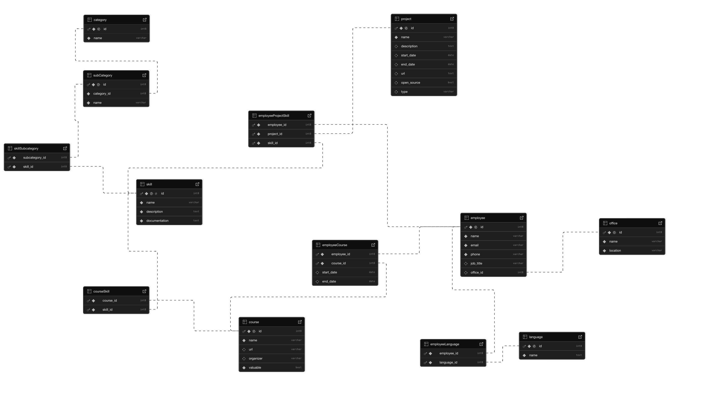
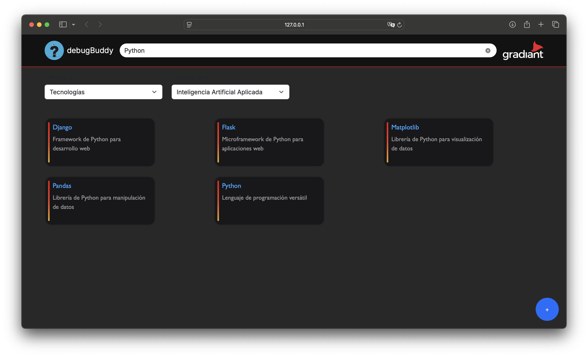
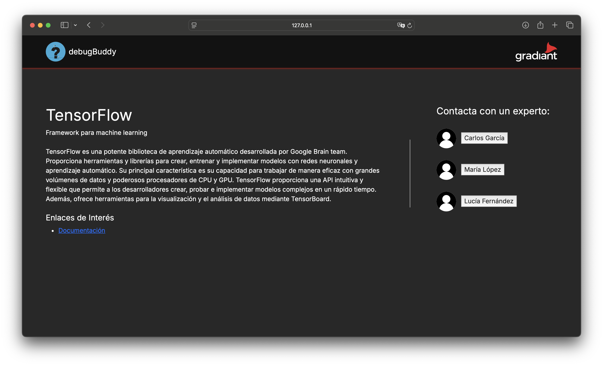
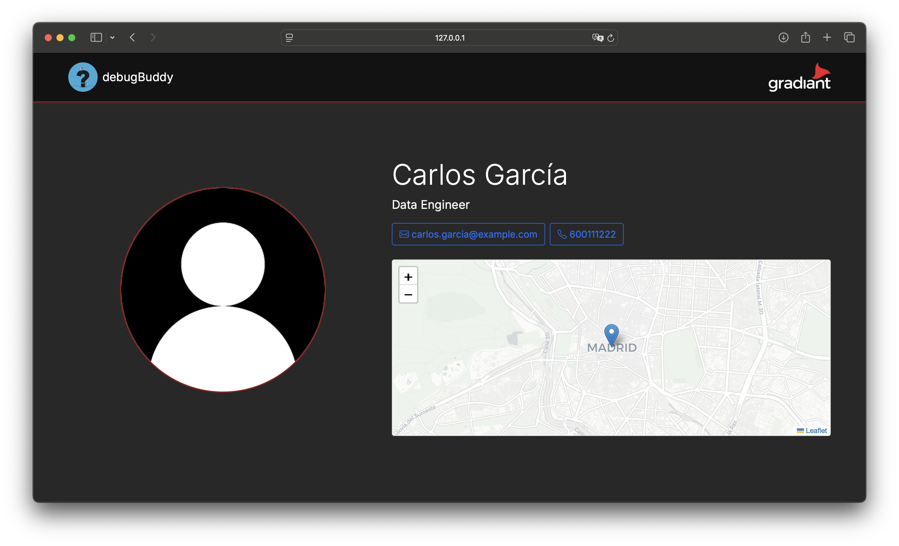

# Reto de Gradiant
# Sistema de registro y consulta de competencias técnicas personales


La expansión de la empresa como Gradiant, ha supuesto un crecimiento significativo en el número de empleados de la empresa. Esto trae como consecuencia que la empleados o directios no sean capaces de saber a qué personal deben recurrir, invirtiendo una gran cantidad de tiempo en investigar esta información e intentando capacitar a sus empleados cuando en la realidad ya los posee.

El problema descrito anteriormente es que se busca solucionar a partir de esta interfaz web, que se basa en un buscador de empleados cualificados, ya sea para el uso de una tecnología particular. Esta información resulta valiosa para que un directivo sepa a quién contactar para un cierto proyecto y así conseguir el máximo rendimiento. Asimismo, estos empleados pueden de ser gran ayuda para asesorar a aquellos que no cuentan con la experiencia suficiente, ayudando así a Gradiant a ser una organización con trabajadores que están en la vanguardia en la industria tech.

## <u>DESAROLLO</u>


#### SISTEMA DE BASE DE DATOS RELACIONAL
Creación del sistema de base de datos relacional para la extracción de información de las skills, qué empleados tienen experiencia con estas y cómo la han conseguido, ya se a través de cursos, proyectos personales o de la empresa. Además, para registrar su información de contacto que permite a cualquier empleado de Gradiant poder comunicarse con él mediante correro o teléfono. Para ello, se utilizo la herramienta de la nube Supabase, que pemitió el trabajo colaborativo para el desarrollo de las relaciones. También, se definieron queries pre-fabricadas para automatizar la recopilación de información. 




#### DESAROLLO WEB

Después del desarrollo de la lógica subyacente para la extracción de la información. A partir del framework Flask de Python para la creación de APIs que permitan la transferencia de información del back-end al fronted, así como para definir las URLs principales del sitio web. También, se utilizó el lenguaje de marcas y de diseño HTML y CSS, así como JS para añadir interacción. El principal objetivo para el diseño de esta interfaz web es que cualquier directivo de Gradiant pueda ver las destrezas más importantes que se utilizan en la compañía y a quién/es puede/n recurrir, de una manera fácil y sencilla. 

Un aspecto novedoso en esta etapa del proyecto fue la implementación del modelo DeepSeek de 6.7B de parámetros para la generación de la descripciones de las destrezas. De esta manera, no se almacena este atributo en la relación y se tiene una descrićión precisa y actualizada en un párrafo de a lo sumo 300 palabras. 

Finalmente, para las decisiones relacionadas al front-end se escogieron colores asociados al logo de Gradiant, ya que cómo se mencionó que en la presentación del reto, este representa un producto que la compañía realmente necesita. Por ello, se consideró oportuno crear esta interfaz web como si fuese propia de la organización.

A continuación, se presenta las pestañas diseñadas:

1. Menú principal:



2. Descripción de una destreaza:




3. Información de contacto:




## <u>Librerías principales</u>

 <table>
  <tr>
    <th>Nombre</th>
    <th>Versión</th>
    <th>Propósito</th>
  </tr>
  <tr>
    <td>Python-dotenv</td>
    <td>1.0.1</td>
    <td>Exportar variables de entorno</td>
  </tr>
  <tr>
    <td>Flask</td>
    <td>3.1.0</td>
    <td>Gestión del sitio web</td>

  </tr>
  <tr>
    <td>Supabase</td>
    <td>2.13.0</td>
    <td>Base de datos en la nube</td>
  </tr>
</table> 

---

## <u>Licencias</u>

 <table>
  <tr>
    <th>Nombre</th>
    <th>Versión</th>
    <th>Licencia</th>
  </tr>
  <tr>
    <td>Bootstrap</td>
    <td>5.3.0</td>
    <td>MIT</td>
  </tr>
  <tr>
    <td>Flask</td>
    <td>3.1.0</td>
    <td>BSD-3-Clause</td>

  </tr>
  <tr>
    <td>Supabase</td>
    <td>2.13.0</td>
    <td>Apache License 2.0</td>
  </tr>
</table> 

```bash
# Instalación en consola
python3 -m venv venv

source venv/bin/activate

pip install -r requirements.txt
```
